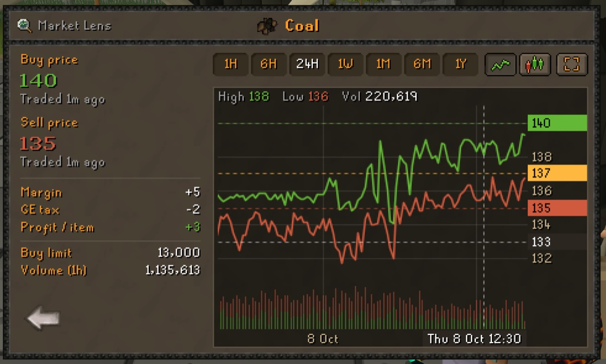
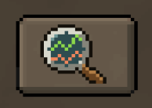
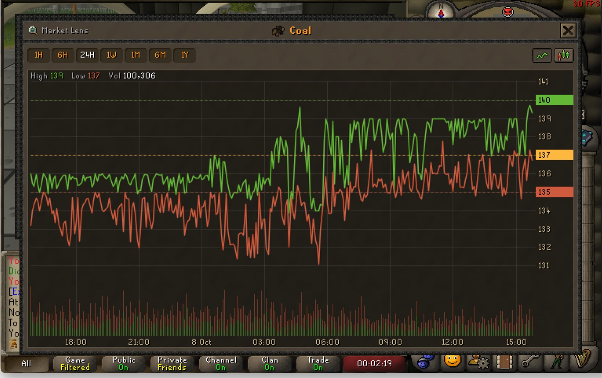
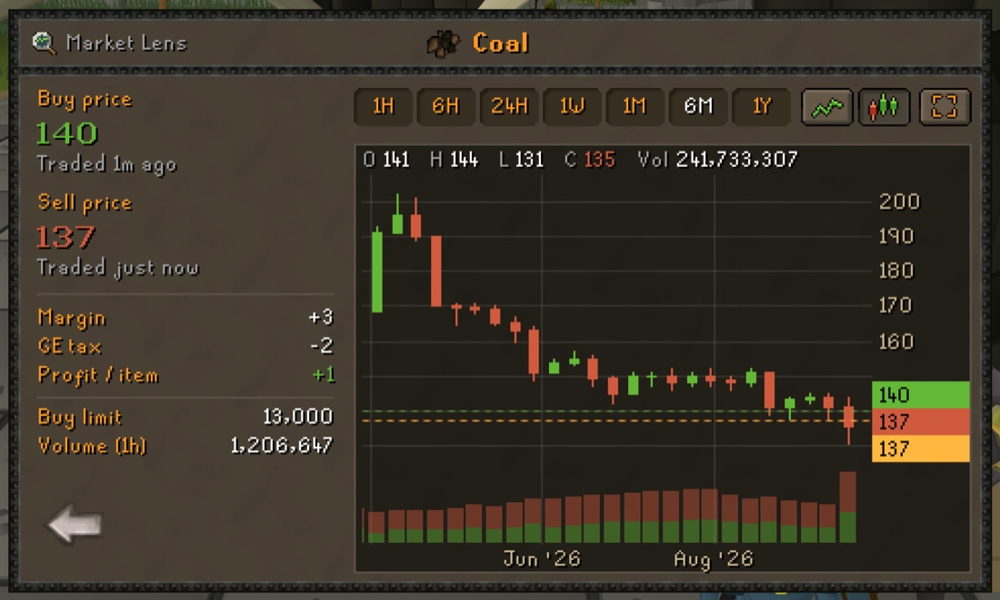

#  Market Lens

Real-time Grand Exchange price charts, right inside the GE offer screen.



## How it works

1. **Set up a buy or sell offer.** A small magnifier button appears to the right of Confirm.

   

2. **Click it** to see the item's live prices next to a price chart, in a window that looks like the rest of the GE.
3. **Expand the chart** to see it over most of the game screen.



## Features

**Prices**

- Instant buy and sell price, with the time of the last trade
- Margin, GE tax (2%, capped at 5M, exempt items handled) and profit per item
- Buy limit and 1-hour trade volume

**Chart**

- Line or candlestick chart, with volume bars
- Timeframes: 1H, 6H, 24H, 1W, 1M, 6M, 1Y
- Live price tags, and the price you entered on the GE offer screen as a line, so you can see where your offer sits
- A crosshair that shows the time and price under the mouse, snapped to whole coins
- Dense data is merged into larger intervals using volume-weighted averages, so the chart stays readable without losing accuracy. Zoom in to see every 5-minute bucket.



**Controls**

| Action | Control |
| --- | --- |
| Zoom (keeps the newest data in view) | Scroll |
| Zoom around the mouse | Shift or Ctrl + scroll |
| Move through time | Drag |
| Reset the view | Double-click |
| Close the expanded chart, then Market Lens | Esc |

## Settings

| Setting | Default | What it does |
| --- | --- | --- |
| Default timeframe | 24H | Timeframe the chart opens with |
| Remember last timeframe | Off | Open with the timeframe you used last instead |
| Chart type | Line | Line or candles; also changed and remembered with the buttons above the chart |
| Buy colour / Sell colour | Green / red | Colours of the prices, lines, candles, volume and tags |
| Show volume bars | On | Traded volume below the price chart |
| Show offer price line | On | The price entered on the GE offer screen, as a line on the chart |
| Cross cursor on chart | On | A cross cursor while the mouse is over the chart |
| Snap crosshair to whole coins | On | The crosshair's price jumps from one whole coin to the next |
| Time format | Automatic | 12- or 24-hour clock; Automatic follows your computer's language and region |

## Price data

Prices come from the [OSRS Wiki real-time prices API](https://oldschool.runescape.wiki/w/RuneScape:Real-time_Prices).
Market Lens only asks for data while its window is open, or when you point at its button, and only for that one item.
Data is cached and never fetched more often than the wiki updates it. Requests only name the item; nothing about you or your account is sent.

## Support

Market Lens is free. If it helps your flipping, you can [buy me a coffee](https://buymeacoffee.com/elertan) ☕

<details>
<summary><b>Development</b></summary>

```bash
./gradlew run     # starts RuneLite in developer mode with the plugin loaded
./gradlew test    # unit tests for price data, caching, GE tax and chart maths
```

On macOS with Java 17 or newer, RuneLite needs one extra JVM option to start:

```bash
JAVA_TOOL_OPTIONS="--add-opens=java.desktop/com.apple.eawt=ALL-UNNAMED" ./gradlew run
```

The icons are generated pixel art. To change them, edit [`tools/make_icons.py`](tools/make_icons.py) and run:

```bash
python3 tools/make_icons.py
```

Other icon designs that were considered (candlesticks, price tags, an eye, ...) are kept in
[`tools/icon_concepts.py`](tools/icon_concepts.py); their PNGs and an overview sheet are in
[`tools/icon-concepts/`](tools/icon-concepts/). Regenerate them with `python3 tools/icon_concepts.py`.

| Package | Contents |
| --- | --- |
| `price` | Wiki API client, cache/refresh policy, GE tax |
| `chart` | Pure chart maths: viewport (zoom/pan), scale, axis ticks, label layout, formatting |
| `ge` | Adds the Market Lens button to the GE offer setup screen |
| `ui` | Normal and expanded windows, chart renderer and overlays, mouse input, shared chart state |

</details>
